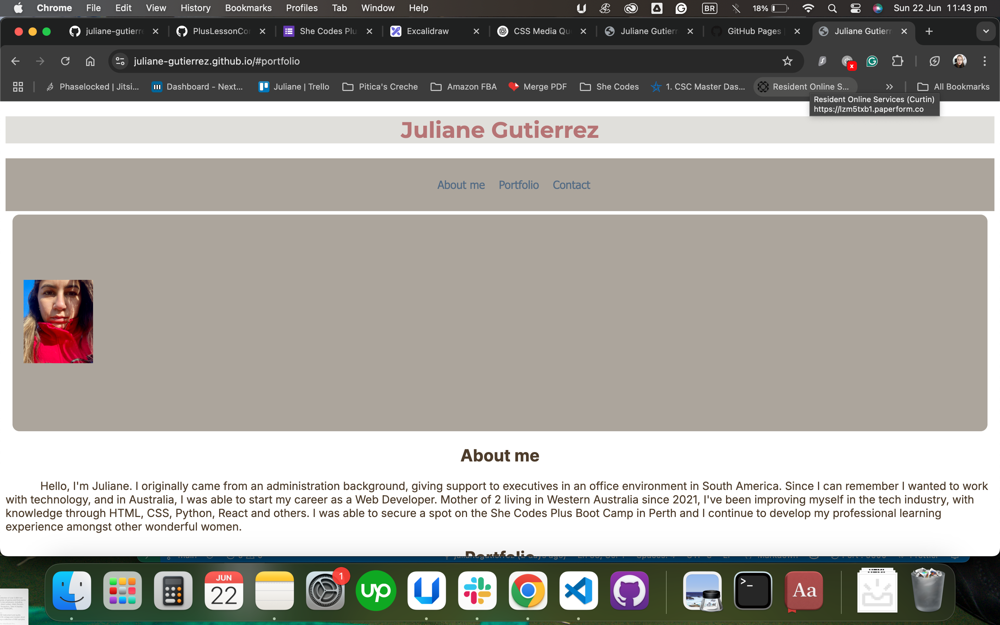

#  juliane-gutierrez - Portfolio Task
​
[My portfolio site](juliane-gutierrez.github.io)
​
## Project Requirements

### Content
 Add a short paragraph describing the features below. What aesthetic and technical choices did you make? 
- [ ] At least one profile picture OKAY
- [ ] Biography (at least 100 words) OKAY
- [ ] Functional Contact Form OKAY
- [ ] "Projects" section OKAY
- [ ] Links to external sites, e.g. GitHub and LinkedIn. OKAY
<!-- I believe its all done, with some upgrade I want to do, as adding my index page link on my h1 -->
​
### Technical
 Add a short paragraph describing the features below. What strategies or design decisions did you work from? 
- [ ] At least 2 web pages. OKAY
- [ ] Version controlled with Git OKAY?
- [ ] Deployed on GitHub pages. OKAY
- [ ] Implements responsive design principles. OKAY
- [ ] Uses semantic HTML. OKAY?

### Bonus (optional)
 Add a short paragraph describing the features below, if you included any. 
- [ ] Different styles for active, hover and focus states.
- [ ] Include JavaScript to add some dynamic elements to your site. (Extra tricky!)
​
### Screenshots
> Please include the following:
> - The different pages and features of your website on mobile, tablet and desktop screen sizes (multiple screenshots per page and screen size).
> - The different features of your site, e.g. if you have hover states, take a screenshot that shows that.  
> 
> You can do this by saving the images in a folder in your repo, and including them in your readme document with the following Markdown code: 

####  julianewireframe 

####  julianeprojectscreenshot

####  julianescreenshotcontactpage

####  julianefooterlinks
